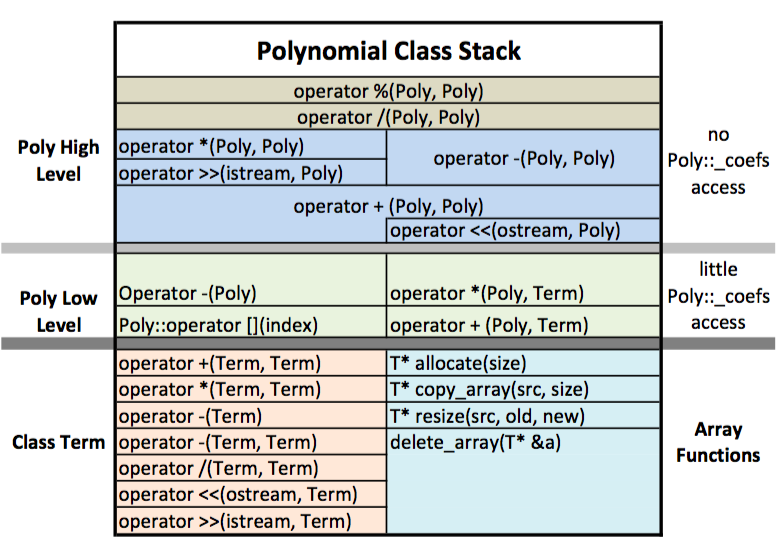

# Polynomials

- Accept [11_p6_polynomial ](https://classroom.github.com/a/ciTm8wKV)
- Get [basic_test.cpp](basic_test.cpp)

---

Please read the [Guidelines for classes](https://docs.google.com/document/d/1dkqJa-h6e-GmlNwc-zgX7IPTrU8YJNMLrbrLS8idU3k/edit?usp=sharing) before you begin.

## Project Description

We will design a class that allows addition, subtraction, multiplication, division, and comparison of polynomials. As the saying goes, "if it looks easy, it's difficult. If it looks difficult, it's impossible." and this project looks pretty easy. So, be prepared to spend more time on this than you have on other projects.



## IMPORTANT

- None of the high-level Poly operators will be accessing the Poly::_coefs array. As far as they are concerned, the Polynomial is made up of terms accessed by the subscript operator.
- The low-level Poly functions access the Poly::_coefs array in a minimal fashion. They will call the array functions to allocate and resize the Poly::_coefs.
- Pay attention to where you are in the hierarchy and behave accordingly.


## struct Term

First, let's design a Term structure. This struct will help simplify the Poly functions quite a bit.

```c++
struct Term
{
  // variables
  double _coef;
  int _exp;

  // CTOR
  Term(double coef, int exp);

  // compare exponent
  friend bool operator ==(const Term& lhs, const Term& rhs);
  friend bool operator !=(const Term& lhs, const Term& rhs);
  friend bool operator >(const Term& lhs, const Term& rhs);
  friend bool operator <(const Term& lhs, const Term& rhs);

  friend Term operator + (const Term& lhs, const Term& rhs);
  friend Term operator * (const Term& lhs, const Term& rhs);
  friend Term operator - (const Term& t);
  friend Term operator - (const Term& lhs, const Term& rhs);
  //used in Poly division operator
  friend Term operator / (const Term& lhs, const Term& rhs);
  
  friend ostream& operator <<(ostream& outs, const Term& t);
  friend istream& operator >>(istream& ins, Term& t);
};
```

Now that we have the Term struct, we can design our Poly class much more easily. Many of the Poly functions will, directly or indirectly, go through the Term struct. 

Use assert to prevent some of the functions of the Term to be called with different exponents. For example, + and - are meaningless for terms of different exponents.


## class Poly

This class is pretty self-explanatory. You will allow the user to perform arithmetics on polynomials.

```c++
class Poly
{
public:
  // CTORS
  Poly();
  Poly(double* coefs, int order);

  //BIG 3
  Poly(const Poly& other);
  Poly& operator =(const Poly& rhs);
  ~Poly();

  friend bool operator ==(const Poly& lhs, const Poly& rhs);
  friend bool operator !=(const Poly& lhs, const Poly& rhs);
  friend bool operator >(const Poly& lhs, const Poly& rhs);
  friend bool operator <(const Poly& lhs, const Poly& rhs);

  Term operator[](int order) const;

  friend Poly operator +(const Poly& lhs, const Term& t);
  friend Poly operator +(const Poly& lhs, const Poly& rhs);

  friend Poly operator -(const Poly& p);
  friend Poly operator - (const Poly& lhs, const Poly& rhs);

  friend Poly operator *(const Poly& lhs, const Term& t);
  friend Poly operator *(const Poly& lhs, const Poly& rhs);
  
  friend Poly operator /(const Poly& lhs, const Poly& rhs);
  friend Poly operator %(const Poly& lhs, const Poly& rhs);
  
  friend ostream& operator <<(ostream& outs, const Poly& p);
  friend istream& operator >>(istream& ins, Poly& p);

  double* get_coefs() const;
  int order() const { return _order; }
  void set_order(int new_order);
  void fix_order();           //get rid of highest terms with zero coefs
private:
  int _order;
  double* _coefs;
};
```


### CTORS

1. Default constructor
     - What is an empty polynomial?
     - What are its allocation needs?
1. Two argument constructor
     - assume term 0 of the Poly is stored at index 0 of the array

### The subscript operator []

create and return a Term object from the index of this operator and the coefficient of the Polynomial at that position. This makes your other functions much easier to manage.

### operator >>

Simply loop through the coefficients of the polynomial and send p[i] to the ostream object.

### operator + (Poly, Term)

If you can add a term to a Polynomial, then you can add a bunch of terms to a polynomial. This makes your +(Poly, Poly) trivial

Note that when you add a Term to a Polynomial, you may need to reallocate the array inside the object to fit that Term. [3X^2 + 5X ] + [4x^6]: Now, you need an array to fit a Poly of order 6

## operator +(Poly, Poly)

Way easier now that you have your +(Poly, Term) and your [ ]( ) functions.

## operator *(Poly, Term)

Similar to +(Poly, Term). You will need to reallocate the array.

## operator /(Poly, Poly)

For a refresher lesson on performing long division on polynomials consult your old math books.

this function will also produce the remainder polynomial.

The divide operator will stop dividing when the exponent of the quotient gets to zero. No negative quotients. What's left will be the remainder. (This is reminiscent of the way we divide ints)

### operator %(Poly, Poly)

```c++
Poly operator %(const Poly& lhs, const Poly& rhs)
{
  Poly div = lhs / rhs;
  return lhs - div * rhs;
}
```

You are welcome!

### Comparison operators
If you can manage to pass the work to the Term object, your life will be vastly simplified and your grade will not suffer. Do not brute force this.

### fix_order()

Sometimes while performing operations on Poly objects, you end up with a Poly with higher-order terms having zero coefficients. This function modifies the object and resets the _order to its real value.

 

## TESTING 
For each of the major arithmetic operations (+, -, *, /) write a test function that will take two const by reference Poly arguments.

The function will show the two Polys and indicate what operation is being conducted before displaying the result.

The function will then perform a test to see if the result is valid. (think back to your third-grade math classes) and will display "VERIFIED" if the result passes the test and "  **** VERIFICATION FAILED" if it does not. If the verification fails, you must show the steps you took to test the result and the outcome of each step:

```c++
bool test_div(const Poly& p, const Poly& q)
{
  Poly r = p / q;
  cout<<p<<" / "<<q<<endl;
  cout<<"      = "<<r;
  cout<<"  rem = "<<p % q<<"  ";
  //if r = p / q then r * q + p % q should be equal to p:
  if(r * q + p % q == p){
    cout<<"    VERIFIED"<<endl;
    return true;
  }
  else{
    cout<<endl<<"   >> / <<   VERIFICATION FAILED"<<endl;
    cout<<"   r * q: "<<r * q<<endl;
    cout<<"   p % q: "<<p % q<<endl;
    cout<<"   r * q + p % q: "<<r * q + p % q<<"=/="<<p<<endl;
    return false;
  }
}
```

## Sample Output

(your output must look very close to this in terms of the way p and q and the results and verification appear on the screen. I am sure this can be improved to make it more readable. If you want to take on that challenge, I would be very happy to incorporate your style into this assignment and give you credit, of course.)

```
----------------------
P: [+3.0X^3 +2.0X^2 +X +5.0 ]
Q: [+4.0X^4 +3.0X^3 +2.0X^2 +X +5.0 ]


------- p + q ----------------------
[+3.0X^3 +2.0X^2 +X +5.0 ] + [+4.0X^4 +3.0X^3 +2.0X^2 +X +5.0 ]
      = [+4.0X^4 +6.0X^3 +4.0X^2 +2.0X +10.0 ]  VERIFIED 

------- q + p ----------------------
[+4.0X^4 +3.0X^3 +2.0X^2 +X +5.0 ] + [+3.0X^3 +2.0X^2 +X +5.0 ]
      = [+4.0X^4 +6.0X^3 +4.0X^2 +2.0X +10.0 ]  VERIFIED 

------- p - q ----------------------
[+3.0X^3 +2.0X^2 +X +5.0 ] - [+4.0X^4 +3.0X^3 +2.0X^2 +X +5.0 ]
      = [-4.0X^4 ]  VERIFIED 

------- q - p ----------------------
[+4.0X^4 +3.0X^3 +2.0X^2 +X +5.0 ] - [+3.0X^3 +2.0X^2 +X +5.0 ]
      = [+4.0X^4 ]  VERIFIED 

------- p * q ----------------------
[+3.0X^3 +2.0X^2 +X +5.0 ] * [+4.0X^4 +3.0X^3 +2.0X^2 +X +5.0 ]
      = [+12.0X^7 +17.0X^6 +16.0X^5 +30.0X^4 +34.0X^3 +21.0X^2 +10.0X +25.0 ]  VERIFIED

------- q * p ----------------------
[+4.0X^4 +3.0X^3 +2.0X^2 +X +5.0 ] * [+3.0X^3 +2.0X^2 +X +5.0 ]
      = [+12.0X^7 +17.0X^6 +16.0X^5 +30.0X^4 +34.0X^3 +21.0X^2 +10.0X +25.0 ]  VERIFIED

------- q / p ----------------------
[+3.0X^3 +2.0X^2 +X +5.0 ] / [+4.0X^4 +3.0X^3 +2.0X^2 +X +5.0 ]
      = []  rem = [+3.0X^3 +2.0X^2 +X +5.0 ]  VERIFIED

------- q / p ----------------------
[+4.0X^4 +3.0X^3 +2.0X^2 +X +5.0 ] / [+3.0X^3 +2.0X^2 +X +5.0 ]
      = [+1.3X +0.1 ]  rem = [+0.4X^2 -5.8X +4.4 ]  VERIFIED
[P]  [Q]     e[X]it p
[P]: 6 x5 +4 x3 -2 x1 +3 x0


P: [+6.0X^5 +4.0X^3 -2.0X +3.0 ]
Q: [+4.0X^4 +3.0X^3 +2.0X^2 +X +5.0 ]


------- p + q ----------------------
[+6.0X^5 +4.0X^3 -2.0X +3.0 ] + [+4.0X^4 +3.0X^3 +2.0X^2 +X +5.0 ]
      = [+6.0X^5 +4.0X^4 +7.0X^3 +2.0X^2 -X +8.0 ]  VERIFIED 

------- q + p ----------------------
[+4.0X^4 +3.0X^3 +2.0X^2 +X +5.0 ] + [+6.0X^5 +4.0X^3 -2.0X +3.0 ]
      = [+6.0X^5 +4.0X^4 +7.0X^3 +2.0X^2 -X +8.0 ]  VERIFIED 

------- p - q ----------------------
[+6.0X^5 +4.0X^3 -2.0X +3.0 ] - [+4.0X^4 +3.0X^3 +2.0X^2 +X +5.0 ]
      = [+6.0X^5 -4.0X^4 +X^3 -2.0X^2 -3.0X -2.0 ]  VERIFIED 

------- q - p ----------------------
[+4.0X^4 +3.0X^3 +2.0X^2 +X +5.0 ] - [+6.0X^5 +4.0X^3 -2.0X +3.0 ]
      = [-6.0X^5 +4.0X^4 -X^3 +2.0X^2 +3.0X +2.0 ]  VERIFIED 

------- p * q ----------------------
[+6.0X^5 +4.0X^3 -2.0X +3.0 ] * [+4.0X^4 +3.0X^3 +2.0X^2 +X +5.0 ]
      = [+24.0X^9 +18.0X^8 +28.0X^7 +18.0X^6 +30.0X^5 +10.0X^4 +25.0X^3 +4.0X^2 -7.0X +15.0 ]  VERIFIED

------- q * p ----------------------
[+4.0X^4 +3.0X^3 +2.0X^2 +X +5.0 ] * [+6.0X^5 +4.0X^3 -2.0X +3.0 ]
      = [+24.0X^9 +18.0X^8 +28.0X^7 +18.0X^6 +30.0X^5 +10.0X^4 +25.0X^3 +4.0X^2 -7.0X +15.0 ]  VERIFIED

------- q / p ----------------------
[+6.0X^5 +4.0X^3 -2.0X +3.0 ] / [+4.0X^4 +3.0X^3 +2.0X^2 +X +5.0 ]
      = [+1.5X -1.1 ]  rem = [+4.4X^3 +0.8X^2 -8.4X +8.6 ]  VERIFIED

------- q / p ----------------------
[+4.0X^4 +3.0X^3 +2.0X^2 +X +5.0 ] / [+6.0X^5 +4.0X^3 -2.0X +3.0 ]
      = []  rem = [+4.0X^4 +3.0X^3 +2.0X^2 +X +5.0 ]  VERIFIED
[P]  [Q]     e[X]it q
[Q]: 3 x8


P: [+6.0X^5 +4.0X^3 -2.0X +3.0 ]
Q: [+3.0X^8 ]


------- p + q ----------------------
[+6.0X^5 +4.0X^3 -2.0X +3.0 ] + [+3.0X^8 ]
      = [+3.0X^8 +6.0X^5 +4.0X^3 -2.0X +3.0 ]  VERIFIED 

------- q + p ----------------------
[+3.0X^8 ] + [+6.0X^5 +4.0X^3 -2.0X +3.0 ]
      = [+3.0X^8 +6.0X^5 +4.0X^3 -2.0X +3.0 ]  VERIFIED 

------- p - q ----------------------
[+6.0X^5 +4.0X^3 -2.0X +3.0 ] - [+3.0X^8 ]
      = [-3.0X^8 +6.0X^5 +4.0X^3 -2.0X +3.0 ]  VERIFIED 

------- q - p ----------------------
[+3.0X^8 ] - [+6.0X^5 +4.0X^3 -2.0X +3.0 ]
      = [+3.0X^8 -6.0X^5 -4.0X^3 +2.0X -3.0 ]  VERIFIED 

------- p * q ----------------------
[+6.0X^5 +4.0X^3 -2.0X +3.0 ] * [+3.0X^8 ]
      = [+18.0X^13 +12.0X^11 -6.0X^9 +9.0X^8 ]  VERIFIED

------- q * p ----------------------
[+3.0X^8 ] * [+6.0X^5 +4.0X^3 -2.0X +3.0 ]
      = [+18.0X^13 +12.0X^11 -6.0X^9 +9.0X^8 ]  VERIFIED

------- q / p ----------------------
[+6.0X^5 +4.0X^3 -2.0X +3.0 ] / [+3.0X^8 ]
      = []  rem = [+6.0X^5 +4.0X^3 -2.0X +3.0 ]  VERIFIED

------- q / p ----------------------
[+3.0X^8 ] / [+6.0X^5 +4.0X^3 -2.0X +3.0 ]
      = [+0.5X^3 -0.3X ]  rem = [+2.3X^4 -1.5X^3 -0.7X^2 +X ]  VERIFIED
[P]  [Q]     e[X]it p
[P]: 2 x12


P: [+2.0X^12 ]
Q: [+3.0X^8 ]


------- p + q ----------------------
[+2.0X^12 ] + [+3.0X^8 ]
      = [+2.0X^12 +3.0X^8 ]  VERIFIED 

------- q + p ----------------------
[+3.0X^8 ] + [+2.0X^12 ]
      = [+2.0X^12 +3.0X^8 ]  VERIFIED 

------- p - q ----------------------
[+2.0X^12 ] - [+3.0X^8 ]
      = [+2.0X^12 -3.0X^8 ]  VERIFIED 

------- q - p ----------------------
[+3.0X^8 ] - [+2.0X^12 ]
      = [-2.0X^12 +3.0X^8 ]  VERIFIED 

------- p * q ----------------------
[+2.0X^12 ] * [+3.0X^8 ]
      = [+6.0X^20 ]  VERIFIED

------- q * p ----------------------
[+3.0X^8 ] * [+2.0X^12 ]
      = [+6.0X^20 ]  VERIFIED

------- q / p ----------------------
[+2.0X^12 ] / [+3.0X^8 ]
      = [+0.7X^4 ]  rem = []  VERIFIED

------- q / p ----------------------
[+3.0X^8 ] / [+2.0X^12 ]
      = []  rem = [+3.0X^8 ]  VERIFIED
[P]  [Q]     e[X]it x


----------------------
Press <RETURN> to close this window...
```