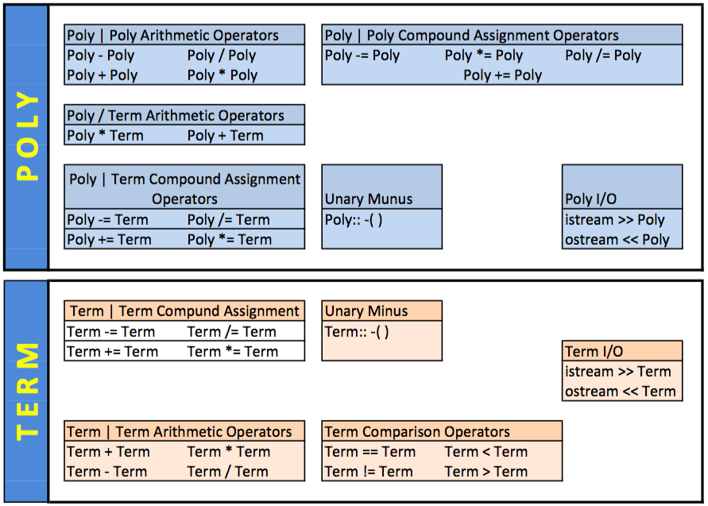

# Polynomial Class With a unique sorted list

- Accept [13_p3_poly_list]()
- Get [basic_test.cpp](basic_test.cpp)




Poly class stores terms in a unique sorted list class. 

## NOTE

The only function in the Poly class that accesses the Term member variables (_exp) is the += compound assignment operator. All other functions reference Term through its operators and constructors.

My Poly class only uses the sorted list's Insert function only once. (you should do the same)

Think Layered Architecture. 


## Term class
The Term class provides enough operators that the higher level Poly class can stop thinking of the exponent and coefficient fields:

```c++
bool double_equals(double left, double right);

struct Term
{
    double _coef;
    int _exp;

    Term();
    Term(double coef, int order);

    Term& operator +=(const Term& rhs);
    Term& operator -=(const Term& rhs);
    Term& operator *=(const Term& rhs);
    Term& operator /=(const Term& rhs);

    friend bool operator ==(const Term& lhs, const Term& rhs);
    friend bool operator !=(const Term& lhs, const Term& rhs);
    friend bool operator >(const Term& lhs, const Term& rhs);
    friend bool operator <(const Term& lhs, const Term& rhs);

    //used in Poly division operator
    friend Term operator + (const Term& lhs, const Term& rhs);
    friend Term operator - (const Term& lhs, const Term& rhs);
    friend Term operator * (const Term& lhs, const Term& rhs);
    friend Term operator / (const Term& lhs, const Term& rhs);

    friend ostream& operator <<(ostream& outs, const Term& t);
    friend istream& operator >>(istream& ins, Term& t);
    Term operator -() const; //unary operator
};
```


## Poly class
The Poly class uses the operators of the Term class to build it's own Poly/Term operators. Then, it builds its own Poly / Poly operators and compounds assignment operators.

```c++
#include "../node/node.h"
#include "../list_sorted/list_sorted.h"
#include "term.h"
#include <iostream>
#include <vector>

using namespace std;

class Poly
{
public:
    Poly();
    Poly(double *term_array, int order);
    Poly(const vector<double>& terms);
    //big three?

    Poly& operator +=(const Term& t);
    Poly& operator *=(const Term& t);

    Poly& operator +=(const Poly& RHS);
    Poly& operator *=(const Poly& RHS);
    Poly& operator -=(const Poly& RHS);

    friend bool operator==(const Poly &left, const Poly &right);
    friend bool operator!=(const Poly &left, const Poly &right);
    friend Poly operator+(const Poly &left, const Poly &right);
    friend Poly operator -(const Poly& left, const Poly& right);
    friend Poly operator * (const Poly& left, const Poly& right);
    friend Poly operator/(const Poly &left, const Poly &right);
    friend Poly operator%(const Poly &left, const Poly &right);
    Poly operator-() const;

    friend Poly operator + (const Poly& left, const Term& t);
    friend Poly operator * (const Poly& left, const Term& t);

    friend ostream& operator << (ostream& outs, const Poly& print_me);
    friend istream& operator >> (istream& outs, Poly& read_me);

    const Term& operator [](const int exp) const;
    Term& operator [](const int exp);
    List<Term> list() const { return _poly; }

private:
    List<Term> _poly; //descending sorted list
    int _order;

};
```