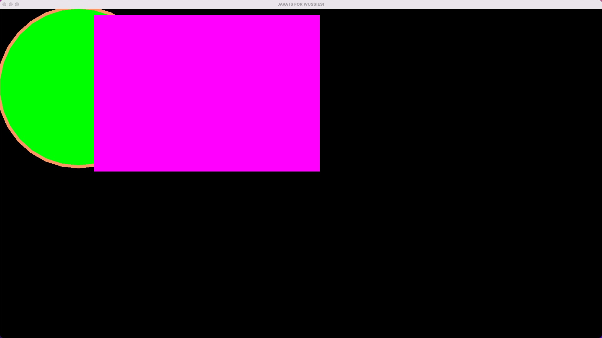
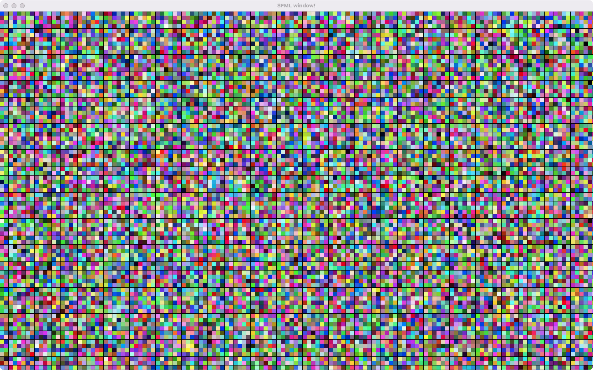
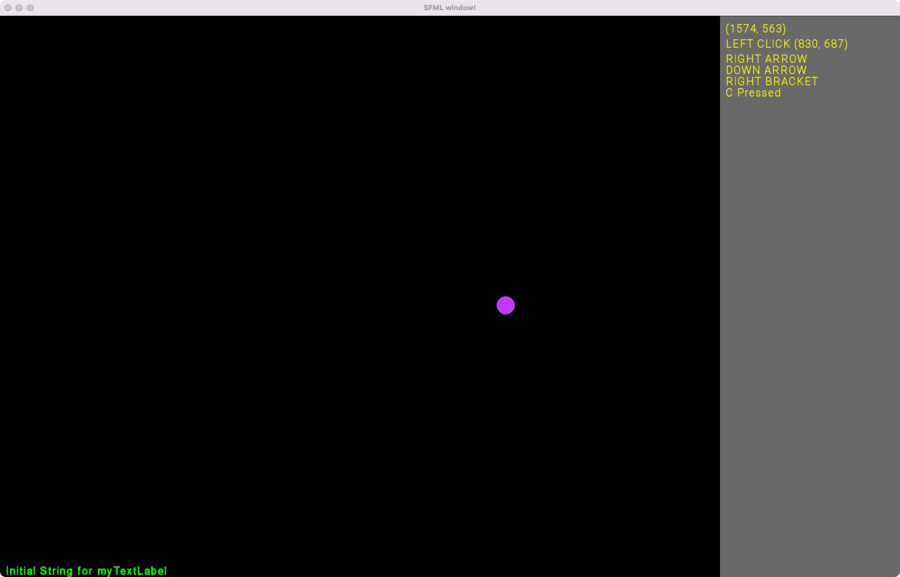

# [SFML](https://www.sfml-dev.org/)

- Accept [88_00_sfml](https://classroom.github.com/a/lmBlzeTZ)

This is a template of CMake project, you can add your SFML code to this project.

Before working on SFML project, you should install SFML.

- [Install SFML (Windows)](https://drive.google.com/file/d/1fHHAV7YIhNbrM-Zl0X-EJ879DS94JxZC/view?usp=sharing)
- [Install SFML (Mac)](https://docs.google.com/document/d/1x1n6g70OMr4AjLbf73KOd5mDQu-2EU29XKltka4jQ5g/edit?usp=sharing)

## Start SFML

Try the init SFML project to make sure you install SFML successfully.

- [start_sfml](start_sfml/main.cpp)

## Animate

Try **animate** SFML project, you will update color for all cells.

- [animate](animate/main.cpp)
 

## Single ball

Try single ball SFML project, you will see a ball moves in main screen on left, and a panel on right with text messages.

- [single_ball](single_ball)

